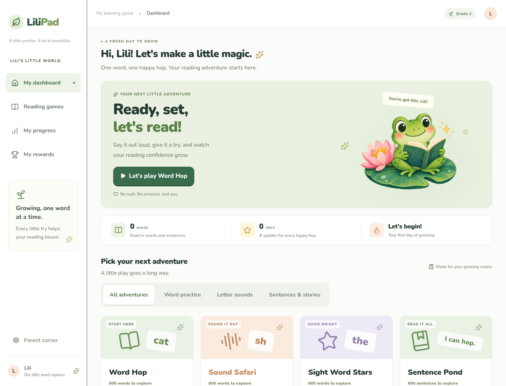
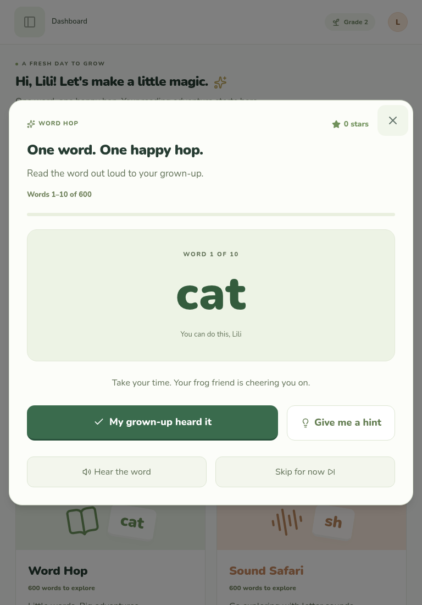
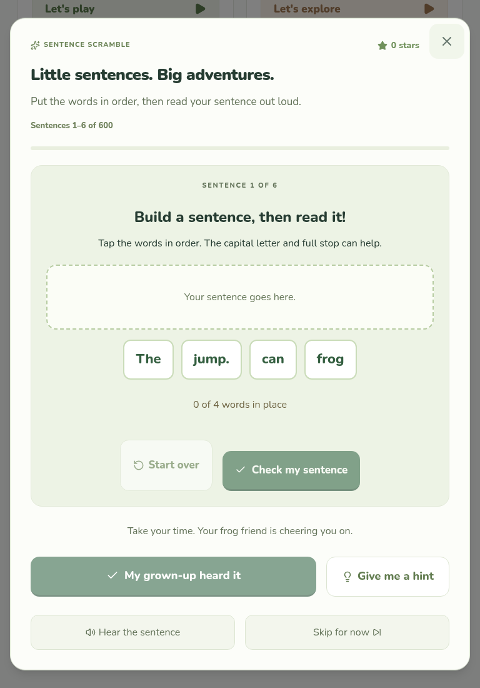

# LiliPad

Touch-friendly reading games for Lili (short for Liliana), built to make practice feel like play. Read words and sentences aloud, get gentle spoken hints, and earn a star with each success. Open speech models run on your device.



## Games

| Adventure | Library | Each round |
| --- | --- | --- |
| Word Hop | 600 words | 10 words |
| Sound Safari | 600 words | 10 words |
| Sight Word Stars | 600 words | 10 words |
| Sentence Pond | 600 sentences | 8 sentences |
| Sentence Scramble | 600 sentences | 6 build-and-read puzzles |
| Story Trail | 101 connected stories, 606 sentences | One six-sentence story |

Libraries save a separate place for each activity. **Next words**, **Next sentences**, or **Next story** opens the next batch. Closing and reopening resumes where you left off. **Skip for now** moves ahead without awarding a star. After the final item, the library loops for review.

Words are curated practice material, including easy words and words to grow into. These are not standardized Fry/Dolch lists or grade-level assessments. Additional sentences and stories use recurring patterns and animal characters to build familiarity.

## Run locally

Use **Node.js 22.13 or newer** and npm. No API keys, database, or speech subscription are required.

```sh
git clone https://github.com/nearbycoder/LiliPad.git
cd LiliPad
npm run install:ci
npm run dev -- --port 4321
```

Open **http://localhost:4321** in your browser. The installer uses the committed lockfile. Before development and production builds, the speech workers and WASM runtime are generated into `public/speech/`; they are not committed.

A clean clone defaults to the portable execution profile. `.sites-runtime/` is checkout-local tooling and can be absent. The `.openai/hosting.json` file identifies the original Sites deployment; it is not a credential. Forks run locally without access to that deployment. Set up your own hosting project before deploying a fork with Sites.

## How to use it

### Read with the microphone

1. Pick an adventure, such as **Word Hop**.
2. Let the listening helper download on the first visit, then tap **Start reading** and allow microphone access.
3. Say the displayed word aloud. You only start the microphone once; the app keeps listening between items.
4. A correct match earns a star and advances automatically after a short celebration. If the app misses the word, try again or use a hint.
5. Tap **Pause listening** for a break. Returning from another tab may also require **Resume listening**.

For difficult isolated words, try the exact phrase **“The word is thin.”** The app accepts this reading phrase followed by the correct word, while keeping different words such as *fin*, *tin*, and *then* separate. Recognition is never supplied with the expected answer.

### Get a hint

**Give me a hint** explains sounds or reads the sentence in small groups. **Hear the word/sentence** plays the complete example. Written hints remain available, and **Stop hint** cancels playback. The microphone is held during hints so the app cannot grade its own voice.

### Practice whole sentences

In **Sentence Pond** and **Story Trail**, read every word in order. Capitalization and punctuation do not affect spoken matching. Correct opening words stay highlighted across pauses, so you can continue the sentence. A wrong fragment clears that attempt; try again from the beginning. Partial sentences do not earn stars.

In **Sentence Scramble**, tap the shuffled word tiles into order. Tap a placed word to return it to the bank, then check your sentence. After building it, read the full sentence aloud to earn the star. Duplicate words have separate tiles.

### Read with a grown-up

In **Parent corner**, turn on **Read together**. A grown-up listens, then taps **My grown-up heard it**. This works without a microphone or speech-recognition download, and these completions are marked separately in progress. Choosing **Device voice** also avoids the natural-voice model download.

<table>
  <tr>
    <td></td>
    <td></td>
  </tr>
  <tr>
    <td>Word Hop in read-together mode</td>
    <td>Build a sentence, then read it aloud</td>
  </tr>
</table>

Screenshots show sample sessions in a desktop browser, including tablet-sized layouts; they do not contain a child's saved reading history.

## Voices, downloads, and privacy

Parent corner lets you choose the voice and listening helper and preview the reading voice.

| Setting | Model or service | Approximate model weights |
| --- | --- | --- |
| Careful listening, default | Moonshine base English | 123 MB |
| Quick listening | Moonshine tiny English | 51 MB |
| Natural voice, default | Kokoro 82M, Heart voice (`af_heart`) | 93 MB |
| Device voice | Browser speech synthesis | No LiliPad voice-model download |

Sizes exclude supporting files. Model files download from Hugging Face on first use and cache when browser storage is available. Clearing or evicting that cache requires another download. The app also keeps a bounded cache of generated hint audio within an adventure.

- Recorded audio is processed locally and is not uploaded or saved by LiliPad.
- Progress, settings, and library positions use browser `localStorage` under `lilypad.v1`. Clearing site data removes them; they do not sync between devices.
- The optional device voice prefers a local English voice, but browser-provided voices can use network services.
- Speech recognition can mishear children's voices. A retry means the recognized text did not match; it is not a reading or pronunciation diagnosis. Read-together mode provides a human alternative.

## iPad and browser support

LiliPad is currently a web app. Its large buttons, touch tiles, navigation drawer, and scrolling reading panels are designed for tablets and smaller screens. It is not yet a native iPad app, and full offline support is not implemented.

Microphone use requires **HTTPS or localhost**, permission to record, and a browser supporting WebAssembly, Web Workers, Web Audio, and AudioWorklet. A network connection is needed for the initial model downloads. Development speech checks used Chromium; performance and recognition still need testing with Lili on her actual iPad. Model speed and available memory depend on the device.

If you open the development server from another device, `http://<computer-ip>:4321` does not provide the secure context required for microphone access. Use an HTTPS preview or deployment.

## Troubleshooting

| Problem | Try this |
| --- | --- |
| Microphone does not start | Check site permissions, use HTTPS/localhost, and tap Resume listening. Read together works without microphone access. |
| First visit feels slow | Allow the selected models to finish downloading. Try Quick listening or Device voice on a slower device. |
| The app keeps mishearing a word | Read in a quiet place, use the exact “The word is …” phrase, listen to a hint, or switch to Read together. |
| Natural voice cannot load or play | Tap the offered Device voice button, or choose Device voice in Parent corner. |
| Progress disappears | Use the same browser and site origin. Private browsing, clearing site data, or blocked storage can prevent persistence. |

## Development

| Command | Purpose |
| --- | --- |
| `npm run dev -- --port 4321` | Start the development server |
| `npm test` | Test matching, segmentation, library positions, sentence tiles, settings, and voice cancellation |
| `npm run typecheck` | Check TypeScript |
| `npm run build` | Build the Cloudflare Workers-compatible app |
| `npm start -- --port 4321` | Serve the production build locally with Wrangler |

The stack is **React 19 + TypeScript, Vinext + Vite 8, Tailwind CSS 4, and shadcn/Radix UI**. Speech uses **Transformers.js 3.8.1, kokoro-js 1.2.1, and ONNX Runtime Web**, with single-thread WASM inference in separate workers. Moonshine uses an fp32 encoder and q8 decoder; Kokoro uses q8 weights. AudioWorklet captures mono audio, resampling to 16 kHz when needed. Stars use a short Web Audio chime.

Key source files:

- `lib/reading.ts`: original practice items, exact transcript matching, short rounds, and progress migration.
- `lib/reading-vocabulary.ts`, `lib/reading-library.ts`: curated word pools and sentence/story templates.
- `lib/reading-pronunciations.ts`: CMUdict subset used for additional sound hints.
- `components/reading-game.tsx`, `components/sentence-builder.tsx`: game flow and touch puzzles.
- `lib/microphone-capture.ts`, `lib/voice-segments.ts`: continuous capture and speech boundaries.
- `lib/speech.worker.ts`, `lib/voice.worker.ts`: local recognition and hint generation.
- `scripts/prepare-speech.mjs`: speech bundle generation and runtime notices.

## License and credits

LiliPad's original source is licensed under **GPL-3.0-only**; see [LICENSE](LICENSE). Copyright © 2026 nearbycoder. Third-party code, fonts, pronunciation data, and model weights retain their own licenses and notices; see [THIRD_PARTY_NOTICES.md](THIRD_PARTY_NOTICES.md).

The frog artwork is an original AI-generated illustration created for this project. Screenshots were captured from the running app. No child photographs or voice recordings are included.

The phonemizer used by Kokoro embeds GPLv3 eSpeak NG. Generated speech bundles are excluded from Git. Distributors of generated bundles must preserve notices and supply the corresponding GPL source; linking a general upstream homepage alone does not establish that requirement is met. [Speech dependency sources and distribution notes](docs/speech-sources.md) identify the pinned wrapper and the remaining upstream provenance limitation.
